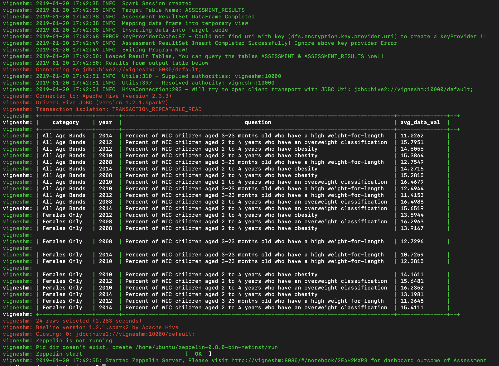
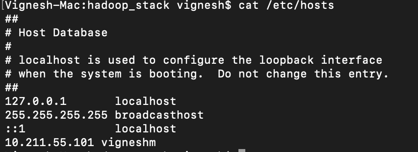
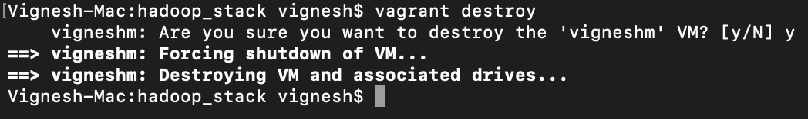

MSD Assessment to load given file into Hadoop Stack
===================================================

# Pre-Requesites

1. [Any Browser](https://www.google.com/chrome/browser/desktop/index.html) to view the zeppelin and other services
2. [Git](https://git-scm.com/downloads) (Optional to download the contents of this repository)
3. [Vagrant](https://www.vagrantup.com/downloads.html) - Download relevant platform installer & run the setup
4. [VirtualBox](https://www.virtualbox.org/wiki/Downloads) - To run the virtual ubuntu machine with hadoop stack

# Services
The virtual machine will be running the following services:

* HDFS NameNode + DataNode
* YARN ResourceManager/NodeManager + JobHistoryServer + ProxyServer
* Hive metastore and server2
* Spark history server
* Zeppelin Server
* At the end batch script will download csv file & load to hive. PySpark will then load the output table with result dataset which will be visualized in Apache Zeppelin

# Getting Started

1. Download and install VirtualBox & Vagrant with above given links.
2. Clone this repo.
3. In your terminal/cmd change your directory into the project directory (i.e. `cd msd_challenge`).
4. Run `vagrant up --provider=virtualbox` to create the VM using virtualbox as a provider (**NOTE** *This will take a while the first time as many dependencies are downloaded - subsequent deployments will be quicker as dependencies are cached in the `resources` directory*).
5. Once aboce command is completed, by this time the data from given [URL](https://chronicdata.cdc.gov/views/735e-byxc/rows.csv), You can see something like this below at the end of the execution i.e., Result Set Loaded into ASSESSMENT_RESULTS Target table,



6. Execute ```vagrant ssh``` to login to the VM.
7. Execute ```beeline -u 'jdbc:hive2://vigneshm:10000/default;' --color=true -n vagrant -p vagrant``` to login to the hive & see the tables created with requested data loaded. 
8. Main ETL Functionality is implemented in a shell script within the scripts directory `data_proc.sh` & PySpark is written in `asmt_results.py`
9. Navigate to ```http://vigneshm:8080/#/notebook/2E4H2MXP3``` for simple visualization built on Zeppelin with given dataset. 

# Work out the ip-address of the virtualbox VM
The ip address of the virtualbox machine will be `10.211.55.101`. Please add this entry to your hosts file in your machine to access the services with hostname instead of IP in browser. Example shown below,



# Web user interfaces

Here are some URL to navigate to various service UI's:

* YARN resource manager:  (http://vigneshm:8088)
* Job history:  (http://vigneshm:19888/jobhistory/)
* HDFS: (http://vigneshm:50070/dfshealth.html)
* Spark history server: (http://vigneshm:18080)
* Spark context UI (if a Spark context is running): (http://vigneshm:4040)

Substitute the ip address of the container or virtualbox VM for `vigneshm` if necessary.

# Shared Folder

Vagrant automatically mounts the folder containing the Vagrant file from the host machine into
the guest machine as `/vagrant` inside the guest.


# Managment of Vagrant VM

To stop the VM and preserve all setup/data within the VM: -

```
vagrant halt
```

or

```
vagrant suspend
```

Issue a `vagrant up` command again to restart the VM from where you left off.

To completely **wipe** the VM so that `vagrant up` command gives you a fresh machine: -

```
vagrant destroy
```


cd /home/ubuntu/zeppelin-0.8.0-bin-netinst/bin/
sudo -sE
./zeppelin-daemon.sh restart
